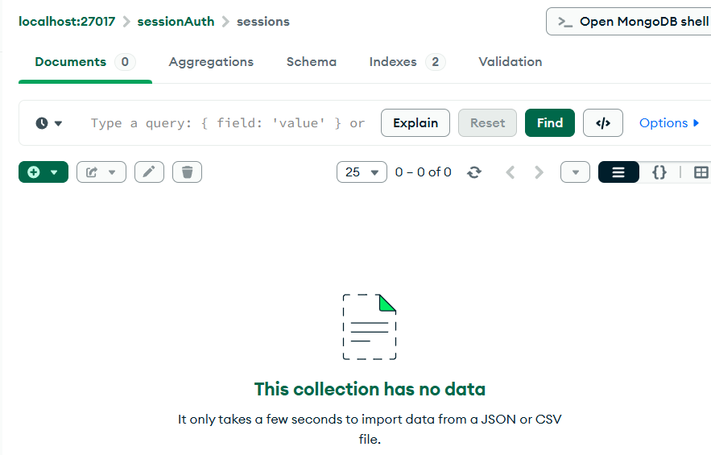

# Cookie Session Authentication

Demo project for authentication system using Cookie and Session with Express.js and MongoDB.

## Overview

This project demonstrates how to implement authentication using:
- **Express Session**: Server-side session management
- **MongoDB Session Store**: Store sessions in MongoDB  
- **Cookie**: Automatically send session ID via cookie
- **bcryptjs**: Password encryption
- **Mongoose**: ODM for MongoDB

## Features

- ✅ User registration with hashed passwords
- ✅ Login with session-based authentication  
- ✅ Session automatically expires after 1 hour
- ✅ Logout and session deletion
- ✅ Protected routes (profile)
- ✅ Sessions stored in MongoDB

## Installation

```bash
npm install
```

## Dependencies

* **express**
* **mongoose**
* **express-session**
* **connect-mongo**
* **cookie-parser**
* **bcryptjs**

---

## Usage

### Prerequisites

Ensure MongoDB is running on `mongodb://127.0.0.1:27017`

### Run application

```bash
node app.js
```

Server will run on `http://localhost:3000`

---

## API Endpoints & Test (LAB requirements)

### 1. Register - `POST /auth/register`

Create new account.

**Request body (JSON):**

```json
{
  "username": "testuser",
  "password": "password123"
}
```

**Response:**

```json
{
  "message": "User registered successfully!"
}
```

**HINT:** After registration, check DB:

```bash
mongosh
use sessionAuth
db.users.find({ username: "testuser" }).pretty()
```

📸 

* 
 — Postman response after register.
* 
 — MongoDB showing saved user.

---

### 2. Login - `POST /auth/login`

**Request body (JSON):**

```json
{
  "username": "testuser", 
  "password": "password123"
}
```

**Response:**

```json
{
  "message": "Login successful!"
}
```

**HINT:**

* After login, Postman **Cookies** tab will show `connect.sid`.
* Meanwhile, DB will have new session:

```bash
db.sessions.find().pretty()
```

📸

* 
 — Postman response + Cookies tab.
* 
 — MongoDB showing session document.

---

### 3. View Profile - `GET /auth/profile`

Access user information (requires valid session).

**HINT:**

* Postman will automatically send cookie if using same session.
* If not, go to Headers tab and add:

  ```
  Cookie: connect.sid=<cookie-value>
  ```

📸 

* 
 — Response showing user information.

---

### 4. Logout - `GET /auth/logout`

**Response:**

```json
{
  "message": "Logout successful!"
}
```

**HINT:**

* After logout, session in DB will be deleted.
* Check again with:

```bash
db.sessions.find().pretty()
```

📸 

* 
 — Postman response when logout.
* 
 — MongoDB no longer has corresponding session.

---

## Workflow

1. **Register** → User saved to MongoDB (password hashed).
2. **Login** → Create session saved in MongoDB → cookie sent to client.
3. **Profile** → Cookie automatically sent → Server validates session.
4. **Logout** → Delete session from MongoDB → Cookie invalidated.

---

## Directory Structure

```
cookie_session_auth/
├── app.js                 # Application entry point
├── package.json
├── models/
│   └── User.js
├── routes/
│   └── auth.js
└── README.md
```

---

## Author: Do Cong Danh